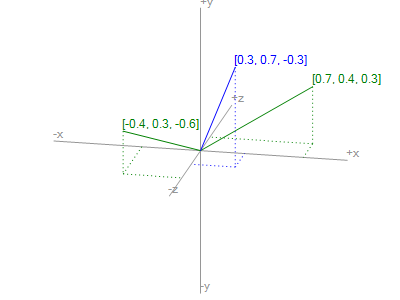

# V
Yet another, reinvented, multidimensional Vector library designed for work with changing dimensionality.

### Requirements
* Microsoft .NET Framework 4.6.1 (Most likely works on older versions, potential TODO)

### Dependencies
* NUnit 3.9.0.0 (for VTest project)
* NUnit Test Adapter 3.9.0.0 (extension for test execution in Visual Studio used only in VTest project)

### Projects
* V - Main functionality
* VExp - Usage samples
* VTest - Tests

### Setup
* Download repository
* Open V.sln in Visual Studio (i'm using 2017 Community version but 2013 and 2015 should work too)
* Build project V (check project properties for output path, most likely ./bin/Debug/)
* V.dll is now ready to be added as reference in your projects

### Future / TODO
* Function RotateAroundAxis should work in all dimensions (currently only in 3)

---

### Samples
Here are some usage examples that might be helpful. Code used for samples and images is available in VExp project.

#### Vector arithmetic operators

##### Addition
```csharp
Vector add1 = new Vector(1, 2) + new Vector(2, 1);
// add1 is now [3, 3]

Vector add2 = new Vector(1, 2) + 2;
// add2 is now [3, 4]

Vector add3 = 2 + new Vector(2, 1);
// add3 is now [4, 3]
```

Visualization of two 3 dimensional vectors (in green) resulting in third vector as a sum (in blue)


##### Subtraction
```csharp
Vector sub1 = new Vector(1, 2) - new Vector(2, 1);
// sub1 is now [1, 1]

Vector sub2 = new Vector(1, 2) - 2;
// sub2 is now [-1, 0]

Vector sub3 = 2 - new Vector(2, 1);
// sub3 is now [0, 1]
```

##### Multiplication
```csharp
Vector mul1 = new Vector(1, 2) * new Vector(2, 1);
// mul1 is now [2, 2]

Vector mul2 = new Vector(1, 2) * 2;
// mul2 is now [2, 4]

Vector mul3 = 2 * new Vector(2, 1);
// mul3 is now [4, 2]
```

##### Division
```csharp
Vector div1 = new Vector(1, 2) / new Vector(2, 1);
// div1 is now [0.5, 2]

Vector div2 = new Vector(1, 2) / 2;
// div2 is now [0.5, 1]

Vector div3 = 2 / new Vector(2, 1);
// div 3 is now [1, 2]
```

##### Inversion
```csharp
Vector inv = -new Vector(1, -2, 3);
// inv is now [-1, 2, -3]
```

#### Functions

##### Min / Max
Produces vector with minimal/maximal values in every dimension.
```csharp
Vector min1 = Vector.Min(new Vector(-1, 1, -1), new Vector(1, -1, 1));
// min1 is now [-1, -1, -1]

Vector min2 = Vector.Min(new Vector(1, 2, 3), new Vector(1, -1, 1), new Vector(5, 1, -1));
// min2 is now [1, -1, -1]

Vector max = Vector.Max(new Vector(-1, 1, -1), new Vector(1, -1, 1));
// max is now [1, 1, 1]
```

##### Normalize
Produces unit vector.
```csharp
Vector nor = Vector.Normalize(new Vector(12, 0, 0));
// nor is now [1, 0, 0]
```

##### Dot
Produces dot product of two vectors.
```csharp
double dot = Vector.Dot(new Vector(1, 0), new Vector(0.5, 0.5));
// dot is now 0.5
```

##### AngleDifference
Produces angle difference between two vectors (in radians).
```csharp
double diff = Vector.AngleDifference(new Vector(0, 1), Vector.Create(2, 0), new Vector(1, 0));
// diff is now half PI
```

##### RotateAroundAxis
Rotates vector around specified axis by angle (in radians).
```csharp
Vector raa = Vector.RotateAroundAxis(new Vector(1, 0, 0), new Vector(0, 1, 0), Math.PI / 2d);
// raa is now [0, 0, 1]
```

##### CloseEnough
Checks proximity of two vectors with specified tolerance.
```csharp
bool closeEnough = Vector.CloseEnough(new Vector(0, 1, -0.1), new Vector(0, 1, 0.1), 0.5);
// closeEnough is True

bool notCloseEnough = Vector.CloseEnough(new Vector(0, 1, -0.1), new Vector(0, 1, 0.1), 0.01);
// notCloseEnough is False
```
